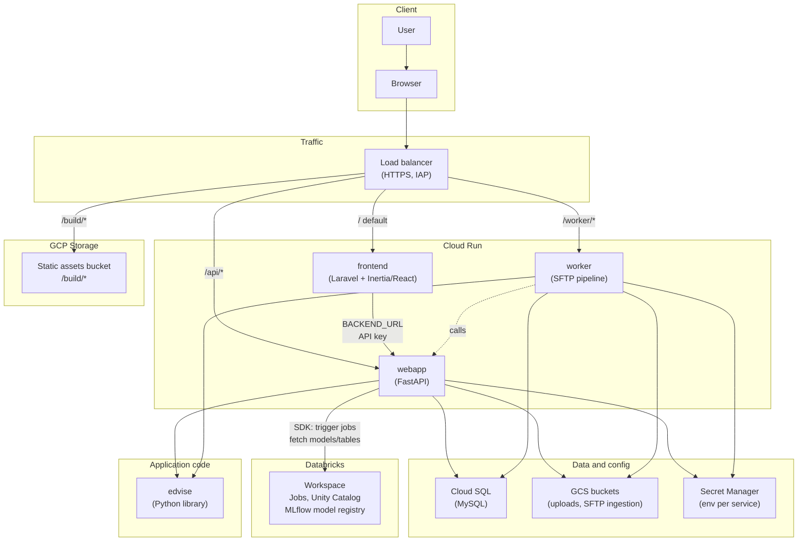

# Edvise application architecture

Edvise is a student-success platform with three app components—frontend (Laravel/React), API webapp (FastAPI), and worker (SFTP pipeline)—plus a shared Python library (edvise), GCP (Cloud Run, Cloud SQL, GCS), and Databricks for ML training and inference. Each environment (dev, staging, prod) runs its own set of Cloud Run services and a single Cloud SQL instance. Terraform in this repo (`terraform/environments/{dev,staging,prod}/`) provisions and manages these environments (state in GCS; apply via Cloud Build trigger or local `terraform apply`).

## High-level diagram

## Component summary

| **Component** | **Repo**       | **Role**                                                                                                                       |
| ------------- | -------------- | ------------------------------------------------------------------------------------------------------------------------------ |
| **frontend**  | **edvise-ui**  | **Laravel + Inertia/React UI; serves pages and static assets (from GCS). Calls webapp at** `BACKEND_URL` **for API.**          |
| **webapp**    | **edvise-api** | **FastAPI service. Auth, uploads, EDA, model runs. Uses edvise library, Cloud SQL, GCS, Secret Manager.**                      |
| **worker**    | **edvise-api** | **Background job (SFTP ingestion, pipelines). Reads from GCS, calls webapp, uses edvise and Cloud SQL.**                       |
| **edvise**    | **edvise**     | **Python library (EDA, ML, validation). Dependency of webapp and worker; also runs on Databricks in training/inference jobs.** |

## Databricks

Databricks is the platform where ML training and inference run. It is a key part of the application.

- **Separate workspaces per environment:** Dev, staging, and prod each have their own Databricks workspace. The webapp and worker connect to the workspace for their environment via config in the env-file secrets (`DATABRICKS_HOST_URL`, `CATALOG_NAME`, etc.).
- **Webapp (edvise-api) talks to Databricks via the Databricks SDK (WorkspaceClient):** triggers jobs (e.g. PDP inference pipeline), provisions per-institution schemas and Unity Catalog volumes (bronze/silver/gold), fetches table data and model versions (MLflow Unity Catalog), and deletes institutions or models. Job run IDs are stored in Cloud SQL.
- **Training and inference execute on Databricks:** edvise library code runs in Databricks jobs (Spark, H2O, MLflow). Pipelines read from GCS or Databricks Volumes, write to Unity Catalog tables and the model registry. PDP inference is defined in edvise (e.g. `pipelines/pdp/resources/github_pdp_inference.yml`) and runs as a Databricks job.
- **Data flow:** Webapp triggers a run → Databricks job runs (edvise + Spark/H2O) → results and models land in Unity Catalog / MLflow → webapp fetches model version or table data via SDK when serving the UI.

Databricks is external to GCP; auth from Cloud Run to Databricks uses a GCP service account (e.g. `GCP_SERVICE_ACCOUNT_EMAIL`) registered in Databricks.

## Infrastructure (per environment)

- **Cloud Run:** `{env}-frontend`**,** `{env}-webapp`**,** `{env}-worker`**. Ingress: internal to load balancer only.**
- **Cloud SQL: One MySQL instance per env. Webapp and frontend share the same DB (e.g.** `users`**); frontend runs Laravel migrations.**
- **GCS: Static assets bucket (**`{project}-{env}-static`**) for** `/build/`***; upload and SFTP ingestion buckets used by webapp and worker.**
- **Secret Manager:** `{env}-{service}-env-file` **per service; populated manually with env vars.**
- **Load balancer: Global HTTPS with managed cert; path-based routing (see diagram). IAP enabled.**

## Environments

| **Environment** | **Branch (current)**         | **Services**                             |
| --------------- | ---------------------------- | ---------------------------------------- |
| **dev**         | **develop**                  | **dev-frontend, dev-webapp, dev-worker** |
| **staging**     | **develop (manual trigger)** | **staging-***                            |
| **prod**        | **develop (manual trigger)** | **prod-***                               |

Each environment has its own Cloud SQL instance, GCS buckets, and secrets. Terraform: `terraform/environments/{dev,staging,prod}/`.